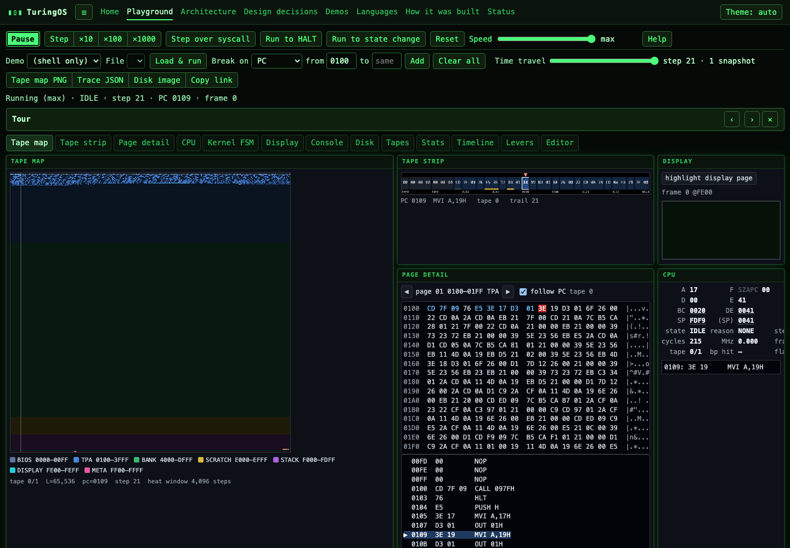

# TuringOS

[](https://github.com/jgoetzmann/Turing-Machine-OS/actions/workflows/ci.yml)
[](https://github.com/jgoetzmann/Turing-Machine-OS/actions/workflows/pages.yml)

An operating system that is literally a Turing machine. The tape is a byte array; the head is an Intel 8080's program counter; the finite control is a six-state kernel; the only door to the outside world is one host abstraction layer. You can watch every head move, every state transition and every tape cell change, natively in a terminal or in your browser, where the same C core runs as WebAssembly.

**Live:** <https://jgoetzmann.github.io/Turing-Machine-OS/>



## What is in the box

- **An 8080 machine on k tapes.** There are 1, 2 or 4 tapes of 32K, 48K or 64K, with a banked window per tape, real cycle counts and every opcode. Accesses past the end of the tape fault, and you can watch it happen.
- **A kernel that is a finite state machine.** Six states and twelve transitions, counted and breakable, taken from the same table the code uses.
- **A shell that runs on the emulated CPU**, written in the project's own C subset and compiled by the project's own compiler. `cc SHELL.C` inside the OS reproduces `shell.com` byte for byte.
- **Four languages.** tiny-C, 8080 assembly, a Turing-machine description language (a TM running on the TM), and Brainfuck. All four compile to `.com` images. There is also a Forth interpreter that runs inside the machine.
- **Demos.** Pong and Life on a 64×32 memory-mapped display, Busy Beavers, a 1-tape vs 2-tape palindrome checker with head-travel odometers, and a program that walks off the end of the tape.
- **Time travel.** Snapshots plus an input log make every run deterministic and seekable to any step.

## Quickstart

```sh
make test        # build the native binary and tools, run the C and shell test suites
make run         # boot the OS in this terminal: try `help`, `dir`, `halt` at the A> prompt
make web         # WebAssembly + site into web/dist (needs Emscripten 6.0.9 and Node >= 22)
make test-web    # Node tests over the wasm build
make test-e2e    # drive the site in a headless browser with Cypress
make help        # every target
```

A session:

```
A> dir
ADD.C
HELLO.C
...
A> cc ADD.C
A> run ADD.COM
3 + 4 = 7
A> halt
HALT
TuringOS halted (reason=COMMAND) after 8643 steps
```

Native flags: `build/turingos [--tapes=1|2|4] [--len=32768|49152|65536] [--hz=N] [--seed=N] [--disks=1|2] [--disk=a.img] [--disk-b=b.img] [--shell=shell.com] [--snap=N] [--snap-dir=dir] [--input=console|keys] [--fps=N] [--display] [--raw=0|1] [--stdin-script=file] [--trace] [--version]`. Scripted runs: `printf 'dir\nhalt\n' | build/turingos --disk=build/disk/demo.img`.

## Repository map

| Path | What |
|---|---|
| `src/emu/` | 8080 CPU, tapes, disassembler |
| `src/kernel/` | the finite state control, trace ring, snapshots |
| `src/bios/`, `src/fs/` | syscalls behind `OUT 01H`; CP/M-style filesystem |
| `src/hal/` | the host boundary: POSIX terminal or JavaScript |
| `src/compiler/`, `src/lang/` | tiny-C, assembler, TM language, Brainfuck |
| `src/shell/` | the shell, in tiny-C, runs on the 8080 |
| `src/api/` | `tos_*`, the one embedding API (native tests and wasm) |
| `tools/` | `mkdisk`, `cc_driver`, `asm`, `tmc`, `bfc`, `disasm`, `bench`, `dump_constants`, `dump_layout`, `bin2c`, `tm_ref.py` |
| `demos/` | the programs on the site, each with a README, a tour and expected output |
| `web/` | Vite + TypeScript site and the visualizer |
| `tests/` | `make test`; one file per area, behavior ids in every test name |
| `docs/` | the documentation below, rendered on the site from the same files |

## Documentation

- [Architecture](docs/architecture.md): the TM mapping, memory map, FSM, ports, syscalls, disk and `.com` formats, generated constants.
- [Levers](docs/levers.md): tape count, tape length, clock, seed, input mode, disks, trace, snapshots.
- [Languages](docs/languages.md), [tiny-C](docs/tiny-c.md), [8080 assembler](docs/asm.md), [TM language](docs/tm.md).
- [Design decisions](docs/decisions.md): every choice with its context, consequences and rejected alternatives, including where this is not a pure Turing machine and why.
- [How it was built](docs/how-it-was-built.md), [Status](docs/status.md), and the [v2 roadmap](docs/v2-roadmap.md) it was built from.

## Contributing

`make test` must pass before anything lands. Interface changes (a port, a syscall, the memory map, a file format, the HAL, the JS API) get an entry in `docs/decisions.md` in the same commit. Commit subjects are imperative and at most 72 characters, with no `Co-Authored-By` or other tool trailers. See `CLAUDE.md` for the working rules.
